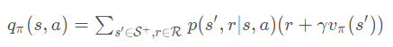
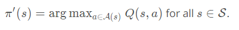
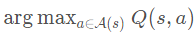
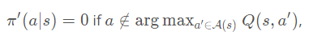
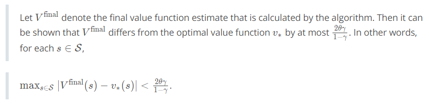

# Part 0 and 1: Iterative Policy Evaluation

The pseudocode for **iterative policy evaluation** can be found below.

Note that policy evaluation is guaranteed to converge to the state-value function vπ corresponding to a policy π, as long as vπ(s) is finite for each state s∈S. For a finite Markov decision process (MDP), this is guaranteed as long as either:

- γ<1, or
- if the agent starts in any state s∈S, it is guaranteed to eventually reach a terminal state if it follows policy π.

Please use the next concept to complete **Part 0: Explore FrozenLakeEnv** and **Part 1: Iterative Policy Evaluation** of `Dynamic_Programming.ipynb`. Remember to save your work!

If you'd like to reference the pseudocode while working on the notebook, you are encouraged to open [this sheet](https://github.com/udacity/rl-cheatsheet/blob/master/cheatsheet.pdf) in a new window.

Feel free to check your solution by looking at the corresponding sections in `Dynamic_Programming_Solution.ipynb`. (*In order to access this file, you need only click on "jupyter" in the top left corner to return to the Notebook dashboard.*)

[To find `Dynamic_Programming_Solution.ipynb`, return to the Notebook dashboard.](https://classroom.udacity.com/nanodegrees/nd101-ent/parts/b4ed3716-d168-4db5-b74b-f224744550e2/modules/6c24dd74-5fba-4e0d-ab27-0f117c2778f1/lessons/face0552-1506-4c3c-ace1-dec3039e738c/concepts/90db191c-be3f-42d8-ac98-11fe6ad8d1de#)

### (Optional) Additional Note on the Convergence Conditions

To see intuitively *why* the conditions for convergence make sense, consider the case that neither of the conditions are satisfied, so:

- γ=1, and
- there is some state s∈S where if the agent starts in that state, it will never encounter a terminal state if it follows policy π.

In this case,

- reward is not discounted, and
- an episode may never finish.

Then, it is possible that iterative policy evaluation will not converge, and this is because the state-value function may not be well-defined! To see this, note that in this case, calculating a state value could involve adding up an infinite number of (expected) rewards, where the sum may not [converge](https://en.wikipedia.org/wiki/Convergent_series).

In case it would help to see a concrete example, consider an MDP with:

- two states s1 and s2, where s2 is a terminal state
- one action aa (*Note: An MDP with only one action can also be referred to as a Markov Reward Process (MRP).*)
- p(s_1,1|s_1, a) = 1

In this case, say the agent's policy \piπ is to "select" the only action that's available, so π(s1)=a. Say γ=1. According to the one-step dynamics, if the agent starts in state s_1s1, it will stay in that state forever and never encounter the terminal state s_2.

In this case, **vπ(s1) is not well-defined**. To see this, remember that vπ(s1) is the (expected) return after visiting state s1, and we have that

vπ(s1)=1+1+1+1+...

which [diverges](https://en.wikipedia.org/wiki/Divergent_series) to infinity. (Take the time now to convince yourself that if either of the two convergence conditions were satisfied in this example, then vπ(s1) would be well-defined. As a **very optional** next step, if you want to verify this mathematically, you may find it useful to review [geometric series](https://en.wikipedia.org/wiki/Geometric_series) and the [negative binomial distribution](https://en.wikipedia.org/wiki/Negative_binomial_distribution).)

# Part 2: Estimation of Action Values

In the next concept, you will write an algorithm that accepts an estimate V of the state-value function vπ, along with the one-step dynamics of the MDP p(s',r|s,a), and returns an estimate Q the action-value function qπ.

In order to do this, you will need to use the equation discussed in the previous concept, which uses the one-step dynamics p(s',r|s,a) of the Markov decision process (MDP) to obtain qπ from vπ. Namely,

holds for all s∈S and a∈A(s).

You can find the associated pseudocode below.

Please use the next concept to complete **Part 2: Obtain qπ from vπ** of `Dynamic_Programming.ipynb`. Remember to save your work!

If you'd like to reference the pseudocode while working on the notebook, you are encouraged to open [this sheet](https://github.com/udacity/rl-cheatsheet/blob/master/cheatsheet.pdf) in a new window.

Feel free to check your solution by looking at the corresponding section in `Dynamic_Programming_Solution.ipynb`.

# Part 3: Policy Improvement

In the last lesson, you learned that given an estimate Q of the action-value function qπ corresponding to a policy π, it is possible to construct an improved (or equivalent) policy π′, where π′≥π.

For each state s∈S, you need only select the action that maximizes the action-value function estimate. In other words,

The full pseudocode for **policy improvement** can be found below.

In the event that there is some state s∈S for which 

is not unique, there is some flexibility in how the improved policy π′ is constructed.

In fact, as long as the policy π′ satisfies for each s∈S and a∈A(s):

it is an improved policy. In other words, any policy that (for each state) assigns zero probability to the actions that do not maximize the action-value function estimate (for that state) is an improved policy. Feel free to play around with this in your implementation!

Please use the next concept to complete **Part 3: Policy Improvement** of `Dynamic_Programming.ipynb`. Remember to save your work!

If you'd like to reference the pseudocode while working on the notebook, you are encouraged to open [this sheet](https://github.com/udacity/rl-cheatsheet/blob/master/cheatsheet.pdf) in a new window.

Feel free to check your solution by looking at the corresponding section in `Dynamic_Programming_Solution.ipynb`.

# Part 4: Policy Iteration

In the previous concept, you learned about **policy iteration**, which proceeds as a series of alternating policy evaluation and improvement steps. Policy iteration is guaranteed to find the optimal policy for any finite Markov decision process (MDP) in a finite number of iterations. The pseudocode can be found below.

Please use the next concept to complete **Part 4: Policy Iteration** of `Dynamic_Programming.ipynb`. Remember to save your work!

If you'd like to reference the pseudocode while working on the notebook, you are encouraged to open [this sheet](https://github.com/udacity/rl-cheatsheet/blob/master/cheatsheet.pdf) in a new window.

Feel free to check your solution by looking at the corresponding section in `Dynamic_Programming_Solution.ipynb`.

# Part 5: Truncated Policy Iteration

In the previous concept, you learned about **truncated policy evaluation**. Whereas (iterative) policy evaluation applies as many Bellman updates as needed to attain convergence, truncated policy evaluation only performs a fixed number of sweeps through the state space.

The pseudocode can be found below.

We can incorporate this amended policy evaluation algorithm into an algorithm similar to policy iteration, called **truncated policy iteration**.

The pseudocode can be found below.

You may also notice that the stopping criterion for truncated policy iteration differs from that of policy iteration. In policy iteration, we terminated the loop when the policy was unchanged after a single policy improvement step. In truncated policy iteration, we stop the loop only when the value function estimate has converged.

You are strongly encouraged to try out both stopping criteria, to build your intuition. However, we note that checking for an unchanged policy is unlikely to work if the hyperparameter `max_iterations` is set too small. (To see this, consider the case that `max_iterations` is set to a small value. Then even if the algorithm is far from convergence to the optimal value function v∗ or optimal policy π∗, you can imagine that updates to the value function estimate VV may be too small to result in any updates to its corresponding policy.)

Please use the next concept to complete **Part 5: Truncated Policy Iteration** of `Dynamic_Programming.ipynb`. Remember to save your work!

If you'd like to reference the pseudocode while working on the notebook, you are encouraged to open [this sheet](https://github.com/udacity/rl-cheatsheet/blob/master/cheatsheet.pdf) in a new window.

Feel free to check your solution by looking at the corresponding section in `Dynamic_Programming_Solution.ipynb`.

# Part 6: Value Iteration

In the previous concept, you learned about **value iteration**. In this algorithm, each sweep over the state space effectively performs both policy evaluation and policy improvement. Value iteration is guaranteed to find the optimal policy π∗ for any finite MDP.

The pseudocode can be found below.

Note that the stopping criterion is satisfied when the difference between successive value function estimates is sufficiently small. In particular, the loop terminates if the difference is less than \thetaθ for each state. And, the closer we want the final value function estimate to be to the optimal value function, the smaller we need to set the value of θ.

Feel free to play around with the value of θ in your implementation; note that in the case of the `FrozenLake` environment, values around `1e-8` seem to work reasonably well.

For those of you who are interested in *more rigorous* guidelines on how exactly to set the value of \thetaθ, you might be interested in perusing [this paper](http://www.leemon.com/papers/1993wb2.pdf), where you are encouraged to pay particular attention to Theorem 3.2. Their main result of interest can be summarized as follows:

Please use the next concept to complete **Part 6: Value Iteration** of `Dynamic_Programming.ipynb`. Remember to save your work!

If you'd like to reference the pseudocode while working on the notebook, you are encouraged to open [this sheet](https://github.com/udacity/rl-cheatsheet/blob/master/cheatsheet.pdf) in a new window.

Feel free to check your solution by looking at the corresponding section in `Dynamic_Programming_Solution.ipynb`.	