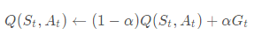

# MC Control: Constant-alpha

In an earlier quiz (**Quiz: Incremental Mean**), you completed an algorithm that maintains a running estimate of the mean of a sequence of numbers (x1,x2,…,xn). The `running_mean` function accepted a list of numbers `x` as input and returned a list `mean_values`, where `mean_values[k]` was the mean of `x[:k+1]`.

When we adapted this algorithm for Monte Carlo control in the following concept (**MC Control: Policy Evaluation**), the sequence (x1, x2, … , xn) corresponded to returns obtained after visiting the *same* state-action pair.

That said, the sampled returns (for the *same* state-action pair) likely corresponds to many *different* policies. This is because the control algorithm proceeds as a sequence of alternating evaluation and improvement steps, where the policy is improved after every episode of interaction. In particular, we discussed that returns sampled at later time steps likely correspond to policies that are more optimal.

With this in mind, it made sense to amend the policy evaluation step to instead use a constant step size, which we denoted by α in the previous video (**MC Control: Constant-alpha, Part 1**). This ensures that the agent primarily considers the most recently sampled returns when estimating the action-values and gradually forgets about returns in the distant past.

The analogous pseudocode (for taking a *forgetful* mean of a sequence (x1, x2, … , xn) can be found below.

This change has been implemented in the `forgetful_mean` function below. The function accepts a list of numbers `x` and the step size `alpha` as input. It returns a list `mean_values`, where `mean_values[i]` is the (`i+1`)-st estimated state-action value.

The `print_results` function analyzes the difference between the `running_mean` and `forgetful_mean` functions. It passes the same value for `x` to both functions and tests multiple values for `alpha` in the `forgetful_mean` function.

Take the time to become familiar with the code below. Then, click on the **[ Test Run ]** button to execute the `print_results` function. Feel free to change the values for `x` and `alpha_values`, if you would like to run more tests to further develop your intuition.

---

## Setting the Value of α

Remember that the `forgetful_mean` function is closely related to the **Evaluation** step in constant-α MC control. You can find the associated pseudocode below.

Before moving on to the next concept, use the above coding environment to verify the following facts about about how to set the value of α when implementing constant-α MC control.

- You should always set the value for α to a number greater than zero and less than (or equal to) one.
  - If α=0, then the action-value function estimate is never updated by the agent.
  - If α=1, then the final value estimate for each state-action pair is always equal to the last return that was experienced by the agent (after visiting the pair).
- Smaller values for α encourage the agent to consider a longer history of returns when calculating the action-value function estimate. Increasing the value of α ensures that the agent focuses more on the most recently sampled returns.

Note that it is also possible to verify the above facts by slightly rewriting the update step as follows:

where it is now more obvious that α controls how much the agent trusts the most recent return Gt over the estimate Q(St, At) constructed by considering all past returns.

**IMPORTANT NOTE**: It is important to mention that when implementing constant-α MC control, you must be careful to not set the value of α too close to 1. This is because very large values can keep the algorithm from converging to the optimal policy π∗. However, you must also be careful to not set the value of α too low, as this can result in an agent who learns too slowly. The best value of α for your implementation will greatly depend on your environment and is best gauged through trial-and-error.