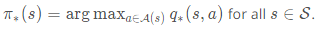

# OpenAI Gym: CliffWalkingEnv

OpenAI Gym: CliffWalkingEnvIn this lesson, you will write your own Python implementations of all of the algorithms that we discuss. While your algorithms will be designed to work with any OpenAI Gym environment, you will test your code with the CliffWalking environment.

[Source: Wikipedia](https://classroom.udacity.com/nanodegrees/nd101-ent/parts/b4ed3716-d168-4db5-b74b-f224744550e2/modules/6c24dd74-5fba-4e0d-ab27-0f117c2778f1/lessons/6c6446dc-86c8-4b1c-a8e4-33cb33cbfae7/concepts/85012ae2-95cc-4216-822e-0e9f79b483f1#)

In the CliffWalking environment, the agent navigates a 4x12 gridworld. Please read about the cliff-walking task in Example 6.6 of the [textbook](http://go.udacity.com/rl-textbook). When you have finished, you can learn more about the environment in its corresponding [GitHub file](https://github.com/openai/gym/blob/master/gym/envs/toy_text/cliffwalking.py), by reading the commented block in the CliffWalkingEnv class. For clarity, we have also pasted the description of the environment below (note that the link below to the Sutton and Barto textbook may not work, and you're encouraged to use [this link](http://go.udacity.com/rl-textbook) to access the textbook):

```python
"""
    This is a simple implementation of the Gridworld Cliff
    reinforcement learning task.
    Adapted from Example 6.6 from Reinforcement Learning: An Introduction
    by Sutton and Barto:
    http://people.inf.elte.hu/lorincz/Files/RL_2006/SuttonBook.pdf
    With inspiration from:
    https://github.com/dennybritz/reinforcement-learning/blob/master/lib/envs/cliff_walking.py
    The board is a 4x12 matrix, with (using Numpy matrix indexing):
        [3, 0] as the start at bottom-left
        [3, 11] as the goal at bottom-right
        [3, 1..10] as the cliff at bottom-center
    Each time step incurs -1 reward, and stepping into the cliff incurs -100 reward 
    and a reset to the start. An episode terminates when the agent reaches the goal.
"""
```

# Part 0 and 1: TD(0)

The pseudocode for TD(0) (or one-step TD) can be found below.

[](https://classroom.udacity.com/nanodegrees/nd101-ent/parts/b4ed3716-d168-4db5-b74b-f224744550e2/modules/6c24dd74-5fba-4e0d-ab27-0f117c2778f1/lessons/6c6446dc-86c8-4b1c-a8e4-33cb33cbfae7/concepts/76343403-fafe-4634-ae2d-6484b233e0f9#)

TD(0) is **guaranteed to converge** to the true state-value function, as long as the step-size parameter α is sufficiently small. If you recall, this was also the case for constant-α MC prediction. However, TD(0) has some nice advantages:

- Whereas MC prediction must wait until the end of an episode to update the value function estimate, TD prediction methods update the value function after every time step. Similarly, TD prediction methods work for continuous and episodic tasks, while MC prediction can only be applied to episodic tasks.
- In practice, TD prediction converges faster than MC prediction. (*That said, no one has yet been able to prove this, and it remains an open problem.*) You are encouraged to take the time to check this for yourself in your implementations! For an example of how to run this kind of analysis, check out Example 6.2 in the [textbook](http://go.udacity.com/rl-textbook).

Please use the next concept to complete **Part 0: Explore CliffWalkingEnv** and **Part 1: TD Prediction: State Values** of `Temporal_Difference.ipynb`. Remember to save your work!

If you'd like to reference the pseudocode while working on the notebook, you are encouraged to open [this sheet](https://github.com/udacity/rl-cheatsheet/blob/master/cheatsheet.pdf) in a new window.

Feel free to check your solution by looking at the corresponding sections in `Temporal_Difference_Solution.ipynb`.

# Part 2: Sarsa(0)

The pseudocode for Sarsa (or Sarsa(0)) can be found below.

[](https://classroom.udacity.com/nanodegrees/nd101-ent/parts/b4ed3716-d168-4db5-b74b-f224744550e2/modules/6c24dd74-5fba-4e0d-ab27-0f117c2778f1/lessons/6c6446dc-86c8-4b1c-a8e4-33cb33cbfae7/concepts/f27a2426-3620-43a2-8284-f3bc476634e0#)

Sarsa(0) is **guaranteed to converge** to the optimal action-value function, as long as the step-size parameter α is sufficiently small, and the **Greedy in the Limit with Infinite Exploration (GLIE)**conditions are met. The GLIE conditions were introduced in the previous lesson, when we learned about MC control. Although there are many ways to satisfy the GLIE conditions, one method involves gradually decaying the value of ϵ when constructing ϵ-greedy policies.

In particular, let ϵi correspond to the i-th time step. Then, if we set ϵi such that:

- ϵi>0 for all time steps i, and
- ϵi decays to zero in the limit as the time step i approaches infinity

then the algorithm is guaranteed to yield a good estimate for q∗, as long as we run the algorithm for long enough. A corresponding optimal policy π∗ can then be quickly obtained by setting:



Please use the next concept to complete **Part 2: TD Control: Sarsa** of `Temporal_Difference.ipynb`. Remember to save your work!

If you'd like to reference the pseudocode while working on the notebook, you are encouraged to open [this sheet](https://github.com/udacity/rl-cheatsheet/blob/master/cheatsheet.pdf) in a new window.

Feel free to check your solution by looking at the corresponding section in `Temporal_Difference_Solution.ipynb`.

# Part 3: Sarsamax

The pseudocode for Sarsamax (or *Q*-learning) can be found below.

[](https://classroom.udacity.com/nanodegrees/nd101-ent/parts/b4ed3716-d168-4db5-b74b-f224744550e2/modules/6c24dd74-5fba-4e0d-ab27-0f117c2778f1/lessons/6c6446dc-86c8-4b1c-a8e4-33cb33cbfae7/concepts/453aaf31-cb5b-43e4-b64f-b87ff88dff65#)

Sarsamax is **guaranteed to converge** under the same conditions that guarantee convergence of Sarsa.

Please use the next concept to complete **Part 3: TD Control: Q-learning** of `Temporal_Difference.ipynb`. Remember to save your work!

If you'd like to reference the pseudocode while working on the notebook, you are encouraged to open [this sheet](https://github.com/udacity/rl-cheatsheet/blob/master/cheatsheet.pdf) in a new window.

Feel free to check your solution by looking at the corresponding section in `Temporal_Difference_Solution.ipynb`.

# Part 4: Expected Sarsa

The pseudocode for Expected Sarsa can be found below.

[](https://classroom.udacity.com/nanodegrees/nd101-ent/parts/b4ed3716-d168-4db5-b74b-f224744550e2/modules/6c24dd74-5fba-4e0d-ab27-0f117c2778f1/lessons/6c6446dc-86c8-4b1c-a8e4-33cb33cbfae7/concepts/56614a53-7e82-48f3-a9fb-1e2db9e3c312#)

Expected Sarsa is **guaranteed to converge** under the same conditions that guarantee convergence of Sarsa and Sarsamax.

Remember that **theoretically**, the as long as the step-size parameter \alphaα is sufficiently small, and the **Greedy in the Limit with Infinite Exploration (GLIE)** conditions are met, the agent is guaranteed to eventually discover the optimal action-value function (and an associated optimal policy). However, **in practice**, for all of the algorithms we have discussed, it is common to completely ignore these conditions and still discover an optimal policy. You can see an example of this in the solution notebook.

Please use the next concept to complete **Part 4: TD Control: Expected Sarsa** of `Temporal_Difference.ipynb`. Remember to save your work!

If you'd like to reference the pseudocode while working on the notebook, you are encouraged to open [this sheet](https://github.com/udacity/rl-cheatsheet/blob/master/cheatsheet.pdf) in a new window.

Feel free to check your solution by looking at the corresponding section in `Temporal_Difference_Solution.ipynb`.

